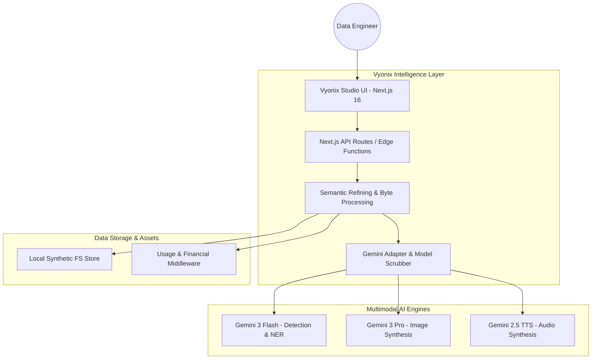

# 🏗️ Vyonix Studio: End-to-End Architecture
### The Blueprint of a Multimodal AI Data Refinery

Vyonix Studio is architected as an industrial-grade **Multimodal Refinery**. It utilizes a decoupled, service-oriented architecture designed to handle massive AI data throughput while maintaining a premium, high-speed user experience.

---

## 🛰️ Global System Design

---

## 🛠️ Proprietary Engineering Triumphs

### 🎥 1. The Audio Reconstruction Engine
Traditional APIs often return raw, container-less sound waves. Vyonix Studio features a native **Audio Header Injector**:
- **PCM Capture**: Intercepts direct L16 PCM data from the `gemini-2.5-flash-preview-tts` model.
- **RIFF/WAV Reconstruction**: Manually calculates byte-rate and block-alignment to inject a valid **44-byte WAV header**.
- **Fidelity**: Locked at **24,000Hz (Mono, 16-bit)** for standard browser and OS player compatibility.

### 👁️ 2. Spatial Coordinate Synchronization
To handle object detection, we use a **Universal 0-1000 Coordinate System**:
- **Normalization**: All AI detections are normalized to a 1000x1000 relative grid.
- **Viewport Mapping**: A transformation matrix on the frontend maps these relative coordinates to a dynamic SVG overlay.
- **Fluid UI**: Detections scale perfectly with the user's **Pan and Zoom** levels.

### 📝 3. NLP Index Self-Correction (Snapping)
We solved "coordinate drift" in text indexing with **Precision Snapping**:
- **Intent-Based Extraction**: The AI returns both index and exact `mention` string.
- **Local Sync**: The UI performs a 20-char fuzzy-search to re-calculate exact DOM offsets, ensuring highlights never cut off words.

---

## 🔒 Enterprise Security: Model Scrubbing
Vyonix Studio is built for professional service providers. An **Interceptor Layer** in our API routes scrubs all references to underlying models. Output is re-branded as **"Vyonix-Intelligence-Proprietary"**, ensuring a fully white-labeled enterprise profile.

---

## 👨‍💻 Author & Architect
**Naresh Matta (VibeDev)**  
*Lead Architect & AI Systems Engineer*

---
© 2026 Vyonix Studio. Built for the Next Generation of AI Data Engineering.
