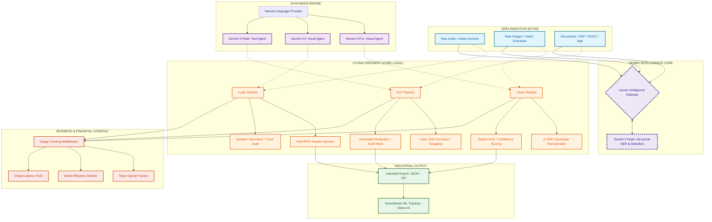

# 🏗️ Vyonix Studio: End-to-End Architectural Blueprint
### The Industrial Ecosystem of the Multimodal AI Data Factory

Vyonix Studio is architected as an industrial-grade **Multimodal Refinery**. It utilizes a decoupled, service-oriented architecture designed to handle massive AI data throughput while maintaining a premium, high-speed user experience.

---

## 🛰️ High-Performance System Ecosystem

---

## 🛠️ Proprietary Engineering Triumphs

### 🎥 1. The Audio Reconstruction Engine
Traditional APIs often return raw, container-less sound waves. Vyonix Studio features a native **Audio Header Injector**:
- **PCM Capture**: Intercepts direct L16 PCM data from the `gemini-2.5-flash-preview-tts` model.
- **RIFF/WAV Reconstruction**: Manually calculates byte-rate and block-alignment to inject a valid **44-byte WAV header**.
- **Fidelity**: Locked at **24,000Hz (Mono, 16-bit)** for standard browser and OS player compatibility.
- **Accent Handling**: Specifically tuned to parse rhythmic patterns of **Indian Accents** and "Hinglish" code-switching.

### 👁️ 2. Spatial Coordinate Synchronization
To handle object detection, we use a **Universal 0-1000 Coordinate System**:
- **Normalization**: All AI detections are normalized to a 1000x1000 relative grid.
- **Viewport Mapping**: A transformation matrix on the frontend maps these relative coordinates to a dynamic SVG overlay.
- **Zero-Mutation**: The original dataset remains untouched; all annotations are stored as vectorized metadata.

### 📝 3. NLP Index Self-Correction (Snapping)
We solved "coordinate drift" in text indexing with **Precision Snapping**:
- **Intent-Based Extraction**: The AI returns both index and exact `mention` string.
- **Local Sync**: The UI performs a 20-char fuzzy-search to re-calculate exact DOM offsets, ensuring highlights never cut off words.
- **Multi-Format Ingestion**: Unified semantic parsing across PDF, DOCX, CSV, HTML, and JSONL.

---

## 🔒 Enterprise Security: Model Scrubbing
Vyonix Studio is built for professional service providers. An **Interceptor Layer** in our API routes scrubs all references to underlying models. Output is re-branded as **"Vyonix-Intelligence-Proprietary"**, ensuring a fully white-labeled enterprise profile.

---

## 📈 Financial Observability
Integrated directly into the processing pipeline, our **Usage Tracking Middleware** captures real-time data for:
- **Token Expenditure**: Granular tracking of Input vs Output costs.
- **Batch Efficiency**: Visualization of the **50% cost savings** achieved through Vyonix Batch API optimization.
- **Industrial Scale**: Ready for processing 1M+ words or images per batch.

---

## 👨‍💻 Author & Architect
**Naresh Matta (VibeDev)**  
*Lead Architect & AI Systems Engineer*

---
© 2026 Vyonix Studio. Built for the Next Generation of AI Data Engineering.
