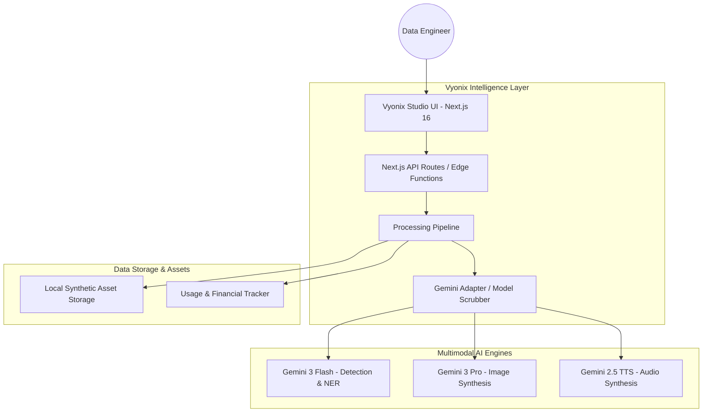

# 🏗️ Vyonix Studio: End-to-End Architecture Design

Vyonix Studio is architected as a **Multimodal Data Refinery**. It leverages a decoupled, service-oriented architecture to handle heavy AI workloads across Audio, Vision, and NLP domains.

---

## 🛰️ High-Level System Architecture

---

## 🛠️ The Multimodal Engine Core

### 1. Audio Intelligence Pipeline
*   **Ingestion**: Supports BYOD (Bring Your Own Data) via Multipart/FormData.
*   **Processing**: Audio is uploaded to the **Gemini File API** for long-context analysis.
*   **Diarization & Sentiment**: Gemini 3 Flash performs a multimodal tonal audit.
*   **TTS Bridge**: Text is converted to PCM L16 via Gemini 2.5 TTS.
*   **Header Injection**: A native Node.js buffer stream reconstructs the **WAV/RIFF header** (24kHz, 16-bit Mono) to ensure standard browser playback.

### 2. Vision Pro Annotation Engine
*   **Coordinate Normalization**: Translates raw image pixels into a **0-1000 normalized grid**.
*   **SVG Rendering Layer**: The frontend uses a dynamic SVG overlay to render bounding boxes without mutating the original image.
*   **Viewport Matrices**: Custom transform-origin logic handles fluid pan/zoom while maintaining annotation alignment.

### 3. NLP & Semantic Refinery
*   **Chunked Analysis**: Documents are split into logical headers/paragraphs to avoid LLM truncation.
*   **Mention-Verification**: A dual-layer logic where the AI provides both indices and the `mention` (string).
*   **Self-Correction**: The UI re-calculates offsets in real-time if a character-count drift is detected between the AI and JavaScript.

---

## 📂 Project Structure & Domain Logic

- **`/app/api/ai/`**: The core API backbone. Each subdirectory (audio, image, text) contains specialized pipelines for synthesis and analysis.
- **`/lib/gemini.ts`**: The central Intelligence Registry. It manages model timeouts (60m+), JSON mode configurations, and security headers.
- **`/lib/prompts.ts`**: The "Brain" of the factory. Contains the high-fidelity prompt engineering required to force Gemini into strict 0-1000 coordinate output and exact NER tagging.
- **`/public/synthetic-*`**: Ephemeral storage for generated assets, ensuring low-latency access for the studio preview players.

---

## 🔒 Security & White-Labeling
The architecture implements a **Model Scrubbing Layer**. Any error or response metadata from the underlying Google APIs is intercepted and re-branded as "Vyonix Intelligence." This ensures that the platform remains a fully white-labeled enterprise solution for Data Service providers.

---

## 📈 Financial & Observability Layer
Integrated directly into the API routes is a **Usage Tracking Middleware** (`lib/usage.ts`). It captures:
- **Token Input/Output**: Directly mapped to financial costs.
- **Duration/Words/Images**: Metric markers for throughput.
- **Batch Savings**: Calculates delta between standard API usage and high-efficiency Batch pipelines.

---
© 2026 Vyonix Studio. Built for Enterprise Multimodal Data Engineering.
