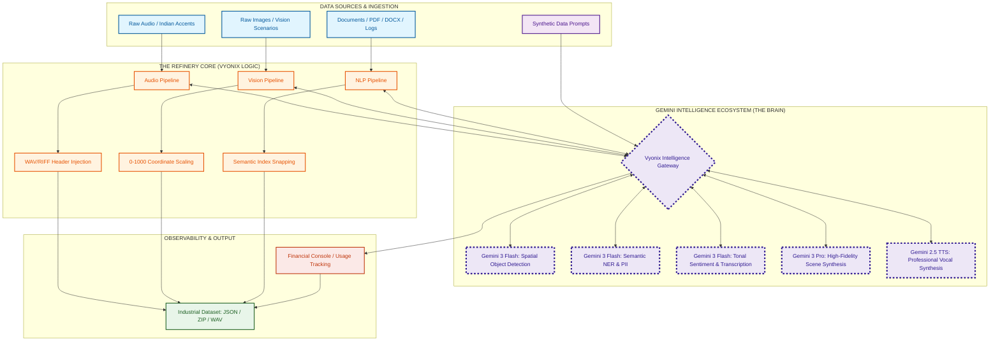

# 🌌 Vyonix Studio: The Multimodal AI Data Factory
### Industrial-Grade Refinery for Data Ingestion, Synthetic Synthesis, & Multimodal Intelligence

  
  
  
  
  

---

## 🏗️ The Unified Multimodal Ecosystem
Vyonix AI Data Factory is a complete **Multimodal Refinery**. It leverages the full-spectrum power of the Gemini Ecosystem to transform raw, chaotic data into high-fidelity "Ground Truth" assets for industrial AI applications.

---

## 🚀 Showcasing the Gemini Powerhouse

### 🎙️ Audio Intelligence Pro: Phonetic Mastery
- **Indian Accent Mastery**: Specifically engineered to master the rhythmic nuances of **Indian accents** where standard models fail.
- **WAV/RIFF Header Injection**: Native Node.js reconstruction of **24kHz/16-bit Mono** audio containers for instant browser and OS player compatibility.
- **Powered By**: **Gemini 3 Flash** (Transcription) & **Gemini 2.5 Flash TTS** (Synthesis).

### 👁️ Vision Pro Studio: Spatial Intelligence
- **0-1000 Coordinate System**: Ultra-precise bounding boxes mapped to a universal relative grid for downstream model training.
- **Synthetic Scene Synthesis**: Leveraging **Gemini 3 Pro** to generate diverse, high-fidelity datasets from simple text prompts.
- **Powered By**: **Gemini 3 Flash** (Detections) & **Gemini 3 Pro** (Generative AI).

### 📝 NLP Engine Pro: Semantic Architecture
- **Index Self-Correction (Snapping)**: Proprietary logic that re-syncs AI tokenization with JS character offsets to ensure **pixel-perfect highlights**.
- **Audit-Grade Redaction**: Automated PII masking (SSN, Phone, email) to ensure data compliance.
- **Powered By**: **Gemini 3 Flash** (Deep Semantic Analysis).

---

## 📊 Business & Financial Intelligence
- **Token Spend Tracker**: Real-time visualization of unit economics and expenditure.
- **Batch Efficiency HUD**: Monitoring the **50% cost savings** achieved through our custom Vyonix Batch Pipelines.
- **White-Label Interceptor**: A secure layer that scrubs model info and re-brands all metadata as **"Vyonix-Intelligence-Proprietary"**.

---

## 👨‍💻 Author & Architect

**Naresh Matta (VibeDev)**  
*Lead Architect & AI Systems Engineer*

---

## 📜 Intellectual Property
**Vyonix Studio is PROPRIETARY software.**  
© 2026 **Naresh Matta**. All rights reserved. Built for the Next Generation of AI Data Engineering.

---
*Developed with Passion for the Multimodal Future.* 🌌💎
