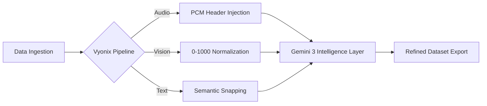

# 🌌 Vyonix Studio: The Multimodal AI Data Factory
### Industrial-Grade Refinery for Data Ingestion, Synthetic Synthesis, & Multimodal Intelligence

  
  
  
  
  

---

## 💡 The Vision
**Vyonix Studio** is a state-of-the-art **AI Data Factory** designed to bridge the gap between chaotic real-world data and structured machine learning gold. Whether you are **Bringing Your Own Data (BYOD)** from complex environments or **Synthesizing Data** to bridge dataset gaps, Vyonix provides the high-fidelity refinery tools to engineer the future of AI.

> *"Data is the soul of AI; Vyonix is its first breath."*

---

## 🎨 Professional Studio Modules

### 🎙️ Audio Intelligence Pro
*Master the phonetic spectrum with industrial precision.*
- **Indian Accent Mastery**: Specifically engineered to handle the rhythmic and phonetic nuances of regional Indian accents and "Hinglish" code-switching.
- **Precision Transcription**: Sub-word level timestamping and speaker diarization via **Gemini 3 Flash**.
- **WAV Header Injection**: Proprietary Node.js logic that reconstructs standard 24kHz/16-bit audio containers from raw PCM streams for instant browser playback.
- **Batch Processing**: Industrial-grade queue management with 50% cost savings using Gemini Batch APIs.

### 👁️ Vision Pro Studio
*Spatial intelligence redefined for surgical labeling.*
- **0-1000 Coordinate System**: Extracts exact normalized bounding boxes for ultra-precise model training.
- **Synthetic Image Generation**: Leveraging **Gemini 3 Pro** to synthesize high-quality training imagery from simple prompts.
- **Interactive Workspace**: Fluid Pan, Zoom, and Draw tools with real-time confidence HUDs.

### 📝 NLP Engine Pro
*Semantic data architecture with audit-grade compliance.*
- **Precision NER & PII**: Automated extraction of 10+ entity types (SSN, Phone, GPE, etc.).
- **Index Self-Correction**: Proprietary snapping logic ensures highlights never drift, matching AI intent to character offsets perfectly.
- **Audit Mode**: One-click redaction layer for PII-compliant data exports.

---

## 🏗️ Architecture Design (The High-Level Blueprint)

### **Core Pillars**
1.  **Direct Waveform Analysis**: We process audio directly to capture tonal sentiment.
2.  **Zero-Mutation Workflow**: Detections are stored as vectorized metadata; your raw data stays pristine.
3.  **Model Scrubbing Interceptor**: A secure layer that re-brands all platform metadata as **"Vyonix-Intelligence-Proprietary"**.

---

## 📊 Business & Financial Intelligence
- **Cost Benchmarking**: Real-time visualization of token expenditure.
- **Savings Tracker**: Monitors the 50% efficiency gains from Vyonix Batch Pipelines.
- **Performance HUD**: Glassmorphic dashboard for Latency, RPM, and System Health.

---

## 👨‍💻 Author & Architect

**Naresh Matta (VibeDev)**  
*Lead Architect & AI Systems Engineer*

---

## 📜 Intellectual Property & License
**Vyonix Studio is PROPRIETARY software.**  
© 2026 **Naresh Matta**. All rights reserved. This project is not open-source. For commercial licensing, enterprise deployment, or acquisition inquiries, please contact the author.

---
*Developed with Passion for the Next Generation of AI Data Engineering.* 🌌💎
