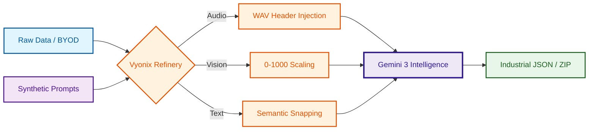

# 🌌 Vyonix Studio: The Multimodal AI Data Factory
### Industrial-Grade Refinery for Data Ingestion, Synthetic Synthesis, & Multimodal Intelligence

  
  
  
  
  

---

## 🏗️ The Data Factory Blueprint
Vyonix Studio is a complete **Data Refinery** designed for industrial AI development. It bridges the gap between raw, messy data and high-quality "Ground Truth" datasets.

---

## 🎨 Professional Studio Modules

### 🎙️ Audio Intelligence Pro
- **Indian Accent Mastery**: Optimized to handle regional accents and "Hinglish".
- **Precision Transcription**: Sub-word timestamps via **Gemini 3 Flash**.
- **WAV Header Injection**: Native Node.js reconstruction of 24kHz/16-bit audio.
- **Batch Processing**: Industrial queueing with 50% cost savings.

### 👁️ Vision Pro Studio
- **0-1000 Coordinate System**: Ultra-precise bounding box extraction.
- **Synthetic Image Generation**: Leveraging **Gemini 3 Pro** for scene synthesis.
- **Fluid Workspace**: Real-time Pan, Zoom, and Draw with Confidence HUDs.

### 📝 NLP Engine Pro
- **Precision NER & PII**: 10+ entity types with automated redaction.
- **Index Self-Correction**: snaps highlights to exact character offsets.
- **Multi-Format Refinery**: Parse PDF, DOCX, CSV, and HTML instantly.

---

## 📊 Business & Financial Intelligence
- **Token Expenditure**: Real-time tracking of unit economics.
- **Savings Monitor**: Visualizes Batch API efficiency gains.
- **System Health**: Glassmorphic dashboard for Latency and RPM.

---

## 👨‍💻 Author & Architect

**Naresh Matta (VibeDev)**  
*Lead Architect & AI Systems Engineer*  
Empowering the next generation of Multimodal Intelligence.

---
© 2026 Vyonix Studio. Built for the Next Generation of AI Data Engineering. 🌌💎
