# 🌌 Vyonix Studio: The Multimodal AI Data Factory
### ⚡ Compressing Years of AI Data Engineering into Days with Gemini 3

---
**Last Updated**: 2026-02-09 04:45 AM IST  
**System Sync**: v4.2.0 (Final Submission Build)  
**Live Demo**: [https://vyonix-studio-service-vob67naxna-uc.a.run.app](https://vyonix-studio-service-vob67naxna-uc.a.run.app)

---

## 🚀 Overview
Vyonix Studio is a unified **"Glass Box" for AI Data Engineering**. It ingests raw, chaotic media (video/audio/text/images) and uses **Gemini 3's multimodal intelligence** to structure it into training-ready assets with forensic precision.

## 💡 Inspiration: The Data Paradox
The biggest bottleneck in AI today isn't models—it's **data**. Most teams spend months building "Frankenstein pipelines" just to label simple datasets. We built Vyonix Studio to prove that a single multimodal model (Gemini 3) can replace an entire data engineering department, collapsing the pipeline from years into days.

---

## 🎙️ **The Intelligence Studios**

### **1. Audio Intelligence Studio**
*Turning sound waves into structured truth.*
- ✅ **Precision Transcription**: Sub-word timestamp accuracy in `HH:MM:SS.mmm` format.
- ✅ **Indian Accent Mastery**: Specifically tuned for Hinglish and regional phonetic nuances where global models usually fail.
- ✅ **Sentiment & Mood Visualizer**: Real-time analysis of pitch, mood (Joy/Anger/Sadness), and speaker shifts.
- 💎 **Recursive Intelligence Loop**: Gemini 3 Flash audits the synthetic output of Gemini 2.5 TTS, ensuring that even synthetic voice training data is mathematically perfectly labeled.

### **2. Vision Pro Studio**
*Zero-Shot Object Detection & Synthetic Video.*
- ✅ **Dynamic Concept Detection**: Detect and track any concept (e.g., "Person in yellow jacket", "Defective solar panel") with no prior training.
- ✅ **Normalized Coordinate Engine**: Translates Gemini's 1000x1000 space into a responsive 0-1000 mapping for universal device compatibility.
- ✅ **Synthetic Video Cycle**: Integrated with Veo 3.1 to generate training videos, which are then "looped back" to Gemini 3 for automatic object labeling.

### **3. NLP & PII Engine**
*Automated Compliance & Structure.*
- ✅ **Forensic PII Detection**: Instant identification of sensitive data for privacy auditing.
- ✅ **Named Entity Recognition**: 10+ entity types extracted from chaotic text.
- 💎 **Diamond Schema Enforcement**: Every output is governed by strict JSON-Schema validation, making it directly ingestible by PyTorch/TensorFlow.

### **4. Financial Console**
*Unit Economics for AI.*
- ✅ **Real-Time Token Tracking**: Millisecond-level cost reporting per request.
- ✅ **Batch API Logic**: Automated switching to Batch API for heavy datasets, providing a **50% cost reduction**.

---

## ⚙️ Architecture: The Glass Box

```mermaid
graph TD
    User["User Interface\n(Next.js / Tailwind CSS)"] 
    API["API Gateway\n(Serverless Node.js)"]
    
    subgraph "Multimodal Intelligence Suite"
        GeminiFlash["⚡ Gemini 3 Flash\n(Transcription, Object Detection, NER)"]
        GeminiPro["🧠 Gemini 3 Pro\n(Reasoning, Image Gen)"]
        GeminiTTS["🗣️ Gemini 2.5 TTS\n(Speech Synthesis)"]
        Veo["🎥 Veo 3.1\n(Video Generation)"]
    end
    
    subgraph "Processing Pipelines"
        AudioProc["Recursive Loop\n(TTS Audio to Flash Audit)"]
        VisionProc["Coordinate Mapper\n(0-1000 Normalization)"]
        NLPProc["Token Corrector\n(Schema Enforcement)"]
    end
    
    User <--> API
    API <--> GeminiFlash
    API <--> GeminiPro
    API <--> GeminiTTS
    API <--> Veo
    
    GeminiFlash --> AudioProc
    GeminiFlash --> VisionProc
    GeminiFlash --> NLPProc
    
    AudioProc --> User
    VisionProc --> User
    NLPProc --> User
```


## 📂 Repository Structure


---

## 🛠️ Technical Implementation
- **Frontend**: Next.js 14 (App Router), Tailwind CSS, Framer Motion for "Glassmorphism" UI.
- **Backend**: Serverless Node.js APIs (Auto-scaling).
- **AI Core**: Google Generative AI SDK (Gemini 1.5/3.0).
- **Video Engine**: Custom React Canvas wrapper for frame-accurate bounding box rendering.

---

## 🏔️ Challenges Overcome
1.  **Coordinate Drift**: We solved the mapping of normalized AI coordinates to responsive CSS aspect ratios using a custom `Subject-Aware Viewport` component.
2.  **Strict Output Enforcement**: We moved away from "chatting" to "querying" by enforcing strict JSON-Mode outputs, turning the AI into a structured data factory.

---

---

## 🚀 Getting Started

### Prerequisites
- Node.js 18+
- Google Cloud Project with Gemini API enabled
- Gemini API Key from [Google AI Studio](https://aistudio.google.com/)

### Installation
1.  **Clone the Repository**:
    ```bash
    git clone https://github.com/inareshmatta/vyonix-studio.git
    cd vyonix-studio
    ```
2.  **Install Dependencies**:
    ```bash
    npm install
    ```
3.  **Environment Setup**:
    Create a `.env.local` file in the root:
    ```env
    NEXT_PUBLIC_GEMINI_API_KEY=your_api_key_here
    ```
4.  **Run Development Server**:
    ```bash
    npm run dev
    ```
    Open [http://localhost:3000](http://localhost:3000) to view the studio.

---

## 🚀 Future Roadmap
- **Marketplace**: A decentralized hub for audited, high-precision datasets.
- **Action Recognition**: Predictive behavioral tracking across video frames.
- **Edge Deployment**: Bringing the "Forensic Auditor" local via MediaPipe.

---
**Built with ❤️ for the Gemini 3 Hackathon**
[Try the Live App](https://vyonix-studio-service-vob67naxna-uc.a.run.app) | [Full Project Reference](https://github.com/inareshmatta/vyonix-studio)
